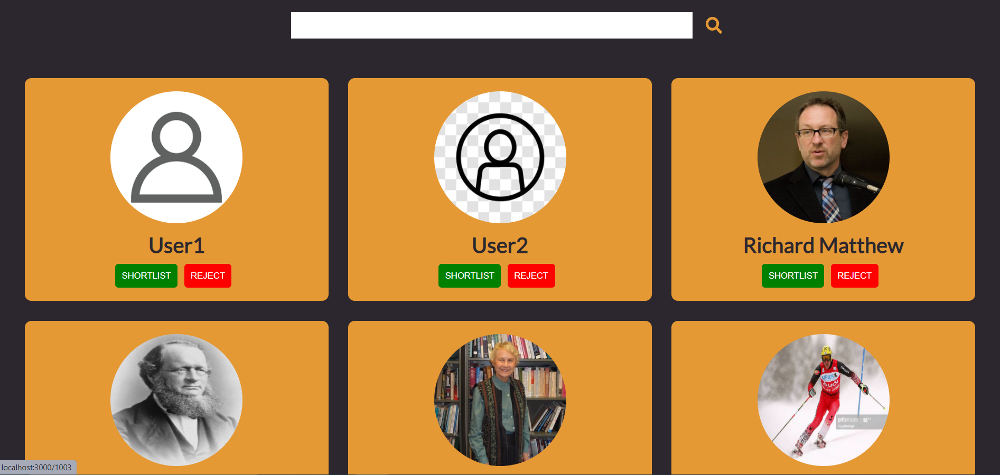
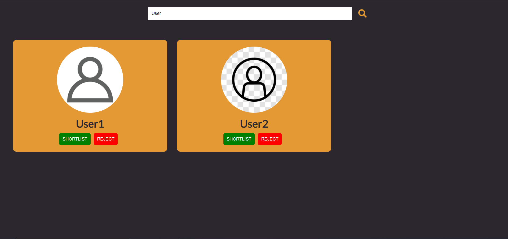
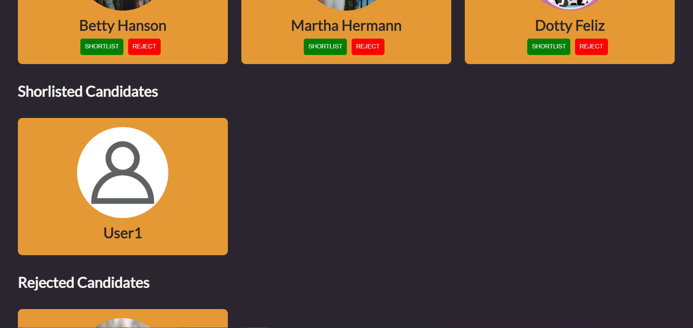
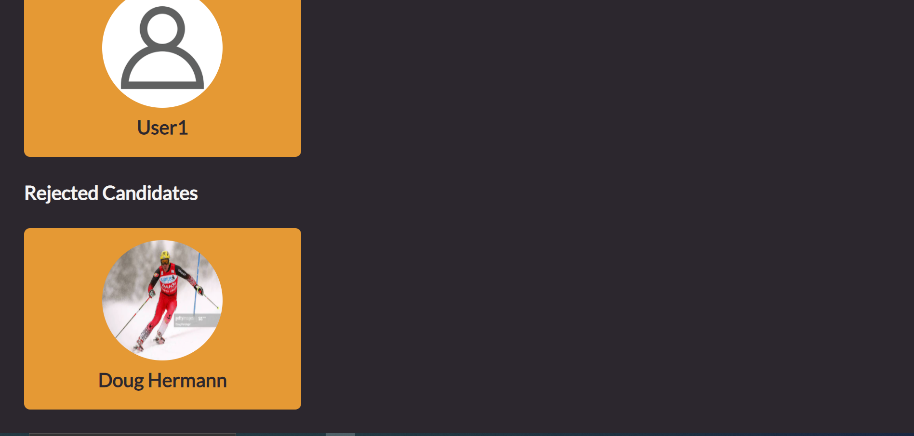

<h1><strong>[Problem Statement]</strong></h1>

Develop a pseudo Frontend Application in React which would let the users list and browse top candidates for a Job. You should solve the <strong>Minimum Requirements </strong>section. Attempting questions in the <strong>Plus Point</strong> section will give you additional credits.

<h2><strong>[Minimum Requirement]</strong>&nbsp;</h2>

Use of Web API to fetch Candidate details.

<ul>
	<li style="">
	
Utilise Response Parameters:

	</li>
</ul>

[ Image, name, id].

<ul>
	<li style="">
	
Implement functionality to list candidates on a web page.

	</li>
</ul>

&nbsp;

<ol>
	<li style="">
	
Display Candidates as Cards (Images with Names).&nbsp;

	</li>
	<li style="">
	
Implement&nbsp; Search by Candidate name.&nbsp;

	</li>
	<li style="">
	
Submit Screenshot, Source code &amp; Instructions.

	</li>
	<li style="">
	
Please use core styling (CSS) and not any external library.

	</li>
</ol>

&nbsp;

<ul>
	<li style="">
	
A feature to click on a Candidate to open a new page showing the details of the Candidate along with the given image and a Shortlist and a Reject Button. Page URL must be of the format “/:id” where id is the id of the Candidate. Clicking Shortlist/Reject must take appropriate action and take us back to the Home Page.

	</li>
	<li style="">
	
Shortlisted and Rejected tabs should be available in the Home Page. Clicking it must list all the Shortlisted and Rejected candidates appropriately in “/shortlisted” &amp; “/rejected” route.

	</li>
</ul>

<h2><strong>[Plus Point]</strong>&nbsp;</h2>

<ul>
	<li style="">
	
Deploy your Frontend App on any Static Website Hosting Service. (This deployment link must be active for at least 2 weeks from Submission Date.)

	</li>
	<li style="">
	
Provide the Deployment URL along with Source Code in a .txt file

	</li>
</ul>

<h2><strong>[Appendix]</strong></h2>

— Candidate API: <a href="https://s3-ap-southeast-1.amazonaws.com/he-public-data/users49b8675.json" style="" target="_blank"><u>https://s3-ap-southeast-1.amazonaws.com/he-public-data/users49b8675.json</u></a>

&nbsp;&nbsp;&nbsp; Note: Use this API to Fetch Candidate details.

— Ideal Frontend Stack :

<ul>
	<li style="">
	
*React only.

	</li>
</ul>

<h2>&nbsp;</h2>

<h2><strong>[Functional Test case]</strong></h2>

<ol>
	<li style="">
	
Searching by candidate name should reflect the appropriate result for valid and invalid scenarios

	</li>
	<li style="">
	
Clicking Shortlist/Reject must take appropriate action and take back to the Home Page&nbsp;

	</li>
	<li style="">
	
Shortlisted and Rejected tabs should be available in the Home Page. Clicking it must list all the Shortlisted and Rejected candidates appropriately in “/shortlisted” &amp; “/rejected” route.

	</li>
</ol>

<h2><strong>[Home Page]</strong>&nbsp;</h2>

<h2>&nbsp;</h2>

<h2><strong>[On Search Results]</strong>&nbsp;</h2>

<h2>&nbsp;</h2>

<h2><strong>[Profile Page]</strong>&nbsp;</h2>

<h2>&nbsp;</h2>

<h2><strong>[ShortListed Candidate]</strong>&nbsp;</h2>
After selecting shorlist button, the candidate will appears under Shorlisted Candidates
<h2>&nbsp;</h2>

<h2>&nbsp;</h2>

<h2><strong>[Rejected Candidate]</strong>&nbsp;</h2>
After selecting shorlist button, the candidate will appears under Shorlisted Candidates
<h2>&nbsp;</h2>
